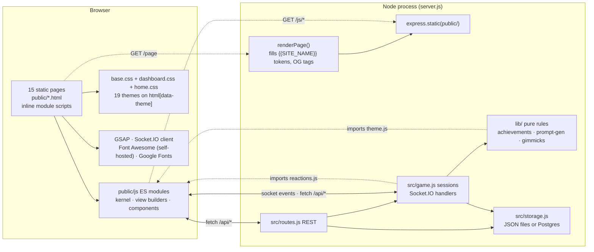
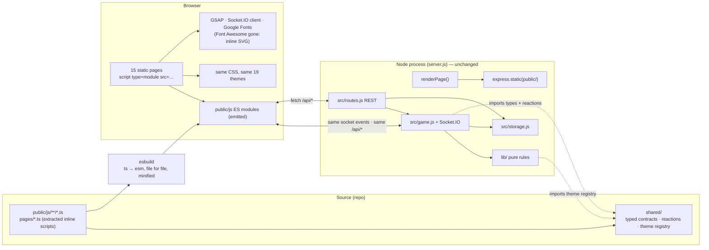
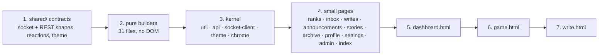

# Frontend assessment: framework or not, and what to do instead

*Written 2026-09-14 on the `migration` branch. Master stays the no-build vanilla app; the work this document proposes lands here.*

## The question

Would this app be better served by a frontend framework, and is React a good choice? The priority is what the user in the browser feels: load time, responsiveness during a live game, and keeping the app cheap to run.

## The answer in one paragraph

No framework. The app's frontend already does, by hand and well, the two things a framework is for: it paints whole-state snapshots from the server with targeted DOM writes, and it owns two `contenteditable` editors outright. Every framework would add a runtime the user downloads and a layer between the code and a DOM the editors need to own. React is the worst fit of the candidates on the merits. What the app actually lacks is a typed contract between server and client, minified assets and one less third-party script, and all three come from **TypeScript plus a minimal esbuild step** with no framework at all.

## What the frontend is today

| Fact | Number |
|---|---|
| Pages | 15 static HTML files, each with its own inline `<script type="module">` |
| Inline page script | ~6,000 lines; `write.html` (1,762), `game.html` (1,567) and `dashboard.html` (726) hold 67% |
| `public/js` modules | 61 files, 11,214 lines; 31 of them are pure string builders with no DOM access |
| CSS | 14,126 lines across `base.css`, `dashboard.css`, `home.css`; 64 `[data-theme]` blocks for 19 themes |
| Client libraries | GSAP (self-hosted, 9 pages), Socket.IO client (4 pages), Font Awesome Free (self-hosted under `public/vendor/fontawesome` since 2026-09-14; it was the kit script on all 15 pages when this was measured), Google Fonts (all 15) |
| Build tooling | None. No bundler, no transpiler, no minifier |
| Tests | 73 files. 38 `client-*.test.mjs` suites import the builders under jsdom; `test/pages.test.mjs` makes 320 assertions over raw page source |
| Server ↔ client coupling | `src/game.js` imports `public/js/components/reactions.js`; `lib/achievements.js` imports `public/js/theme.js`; `renderPage()` in `src/site.js` fills `{{SITE_NAME}}`-style tokens into every page |
| DOM state that must survive a re-render | the game's `#writerEditor` contenteditable, dirty inputs in the host form, the inbox composer drafts that `inbox-panel.js` snapshots and restores around each `render()` |

Rendering pattern, in the game page: every `game-state` broadcast runs `renderWriting(st)`, which writes about ten specific nodes (`innerHTML`/`textContent`/class toggles) and rebuilds the players row. A `turnKey` (turn count + current writer) gates the work that must only happen on a real turn change, such as clearing the live preview. Live typing is relayed on a 140 ms debounce and painted into one element; the countdown is a per-second text write. None of it touches the editor.

### Today's architecture



## What the user pays for today

Measured from the repo on 2026-09-14 (raw bytes on disk; gzip is what the wire carries).

| Asset | Raw | Gzipped |
|---|---|---|
| `base.css` (every page) | 289 kB | 71 kB |
| `gsap.min.js` (9 pages) | 72 kB | 28 kB |
| `game.html` inline script | 66 kB | 20 kB |
| `game.html` direct module imports (30 files) | 208 kB | ~70 kB |
| `write.html` inline script + 14 imports | 191 kB | ~65 kB |
| `dashboard.html` inline script + 10 imports | 118 kB | ~40 kB |
| Font Awesome kit loader (every page, before self-hosting) | 17 kB | ~6 kB, then it fetched its stylesheet and webfonts (a few hundred kB more). Now: one local 58 kB sheet + 184 kB of woff2, cached for a week |
| All of `public/js` | 629 kB | 218 kB |

Two things stand out. First, nothing is minified: comments and whitespace are roughly a third of every module. Second, the single largest third-party cost on every page WAS the Font Awesome kit, which loaded a script that loaded a stylesheet that loaded fonts, three round trips before an icon appeared. That is now self-hosted and cached (done on master before the migration began); the remaining step, inlining the three icons the pages actually use as SVG, would drop the 184 kB of fonts too.

Neither of those is a framework problem, and no framework fixes them. A build step does.

## Framework comparison

Judged against this app: a real-time round-robin game driven by whole-state socket broadcasts, two rich-text editors built on `contenteditable` and `execCommand`, and a visual identity that lives entirely in CSS and hand-drawn SVG.

| Option | Runtime the user downloads (gz) | Whole-snapshot socket state | contenteditable editors | Works without a build | Cost to migrate this codebase |
|---|---|---|---|---|---|
| **Vanilla + TypeScript** | 0 | Already the pattern | Already owned outright | Needs a compile step for TS only | Low: types erased, same modules, same pages |
| React 19 | ~45 kB | Good (`useReducer` over the snapshot) | Poor: virtual DOM fights a DOM the editor mutates; every editor becomes a ref escape hatch | No (JSX + bundler) | High: rewrite ~6,000 lines of page script; `pages.test.mjs` written off |
| Preact + compat | ~4 kB | Same as React | Same as React | Partially (`htm` in the browser) | Same as React |
| Solid | ~7 kB | Very good (fine-grained signals, no diffing) | Better: real DOM nodes, refs are ordinary | No | High, and a smaller ecosystem |
| Svelte 5 | ~2 kB + per-component output | Good (runes) | Better than React, same caveats | No (compiler) | High |
| Vue 3 | ~35 kB | Good | Same class of problem as React | Partially (CDN build) | High |
| Lit / web components | ~6 kB | Fine, manual | Good: it is the DOM | Yes (import from a CDN) | Medium: templates replace string builders one component at a time |

Reading the table:

- **Speed.** Vanilla is the floor. Every framework adds a runtime and, on the game page, a diff on each broadcast where today there are ten direct writes. The differences between frameworks are small next to the difference between "a runtime" and "none".
- **The editors decide it.** `write.html` carries comment anchors that must round-trip byte-exact, a beta-reader guard that compares whole html strings, undo history that lives in the browser's own contenteditable stack, and a toolbar on `execCommand`. Any virtual DOM has to be told to leave that subtree alone, at which point the framework is managing the chrome around a box it is forbidden to touch. That is where React's fit is worst; Lit and Solid are merely awkward.
- **The identity is CSS.** Nineteen themes toggled by one attribute, GSAP scenery, the tower and the clock drawn as SVG strings. A component runtime contributes nothing here.
- **If a framework were ever wanted on the game page alone**, Solid or Lit are the honest candidates: small, and they leave the DOM in your hands. React would be the last choice on the merits.

## Recommendation: TypeScript, no framework, one small build step

### What changes

1. **A `shared/` folder of contracts** that the server and client both import: the socket payloads (`game-state`, `roster`, `chat`, `live-typing`, `game-over`, the gimmick events), the REST response shapes, `promptControls`, the achievements catalogue. Today that contract is enforced by tests and by prose in CLAUDE.md. This is the app's actual weakness, and it is exactly what TypeScript is for. The two client modules the server already imports (`reactions.js`, `theme.js`) move here, which also removes the odd server-imports-from-public edge.
2. **`public/js` becomes TypeScript source** compiled by esbuild to plain ES modules, file for file, no bundling. The module graph, the pages, the ids the tests look for, the Replit Run button: all unchanged. `allowJs` + `checkJs` in `tsconfig` means files convert one at a time and the suite stays green throughout.
3. **Inline page scripts are extracted** to `public/js/pages/<page>.ts` and loaded by `<script type="module" src>`. This is what makes them typable and importable in tests. The HTML keeps every id and class.
4. **Minification and gzip-friendly output** fall out of the same esbuild call. **The self-hosted Font Awesome fonts are replaced** by the three icons the pages use, inlined as SVG (a small `icons.ts` module), which removes the font download entirely.
5. **CSS is untouched.**

### After



Every box under the server is the same as in the "Today" diagram. Only the frontend gained a compile step and a shared contract folder.

### What the user feels

| | Today | After |
|---|---|---|
| Framework runtime downloaded | 0 | 0 |
| JS on the game page (gz) | ~90 kB inline + imports, unminified | roughly a third smaller from minification alone; exact figure once esbuild runs |
| Font Awesome | self-hosted sheet + two woff2, cached a week | none; inline SVG in the page's own JS |
| Time to interactive | governed by the module waterfall and the kit | same waterfall, smaller files, one fewer third-party chain |
| Socket re-render latency | ~10 direct DOM writes per broadcast | identical code, types erased |
| Live typing, countdown, GSAP scenery | untouched | untouched |
| Themes | CSS attribute | CSS attribute |

Lab numbers (Lighthouse, mobile throttling) for `/dashboard` and `/game` should be taken once before the first esbuild commit and once after, and pasted here; the byte table above is the pre-build baseline. Run:

```bash
npm start
npx lighthouse http://localhost:3000/ --preset=perf --form-factor=mobile --output=json --output-path=./lh-home.json
```

`/dashboard` and `/game` need a signed-in session; use Lighthouse's `--extra-headers` with a bearer token from `/api/login`, or run it from Chrome DevTools while signed in.

### What it costs

- **Hosting: nothing.** Replit's VM deployment bills per instance, not per byte. The build runs once per deploy in seconds. `npm start` becomes "build, then start" so the Run button and the deployment command are unchanged.
- **Third parties: one fewer.** The Font Awesome kit and its pricing tier are already gone (self-hosted on master); inlining the icons removes the font files too. Google Fonts and GSAP stay.
- **Developer time: the conversion.** Types on 61 modules and ~6,000 lines of page script, done in the order below with the suite green at each step. Two new dev dependencies, `typescript` and `esbuild`, both stable and boring to upgrade.
- **Risk to players: near zero.** The emitted JS is the same modules with types removed. Behaviour changes only where a type error reveals a real bug, which is the point.

Compare a framework rewrite: the same ~6,000 lines rewritten rather than annotated, a runtime added, `pages.test.mjs` (320 assertions) written off, the 38 client suites rewritten against a component testing library, and the game page's live state and the editor's DOM ownership both re-solved on someone else's terms. And at the end of it the app is not faster.

### Migration order



Shared contracts first because every later step consumes them. Pure builders next because they type in minutes and their tests already exist. The two biggest pages last, once the pattern is proven and the contracts are stable. Each step ships with `npm test` green and a two-tab smoke of a live game.

### Tests

- Server suites: untouched.
- `client-*.test.mjs`: keep importing the modules; either the emitted `.js` (run the build before `npm test`) or the `.ts` directly through a Node type-stripping loader. The emitted-JS route is the simpler one and mirrors production.
- `test/pages.test.mjs`: assertions on ids and classes survive because the HTML keeps them. The assertions that regex over inline script *source* (for example, that a page's script calls a given builder) become imports of the extracted page module, which is a better test anyway.

### Replit

`.replit` keeps `run = "npm start"`. `package.json` gets `"build": "node scripts/build.mjs"` and `"start": "npm run build && node server.js"`. Emitted files under `public/js` are build output: either committed (simplest for Replit, which runs from the repo) or gitignored with the build in `start`. Committing the output is recommended here so a checkout still runs without Node tooling, matching how `public/vendor/gsap.min.js` is handled today.

## Decision

Stay framework-free. Adopt TypeScript with esbuild as a file-for-file compiler, a shared contracts folder, minified output and inline SVG icons. Do it on the `migration` branch in the order above; master keeps shipping the vanilla app until the branch is proven.
